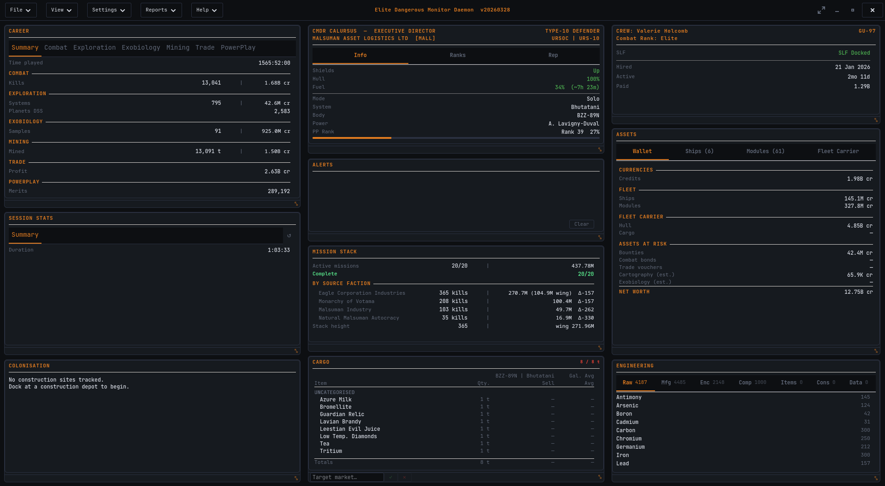
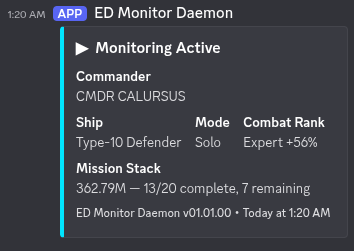

<div align="center">


# Elite Dangerous Monitor Daemon
### EDMD

**Real-time session monitoring dashboard for Elite Dangerous**

*Session tracking · Combat · Trade · Mining · Exploration · Missions · Exobiology · PowerPlay · Fleet assets · CAPI · Discord · GTK4 GUI*

---

by **CMDR CALURSUS**

[](https://python.org)
[]()
[]()
[]()
[]()

</div>

---

## Overview

EDMD is a real-time session monitoring dashboard for Elite Dangerous. It tails your journal and presents a live GTK4 window alongside the game, tracking everything you do across combat, trade, mining, exploration, missions, exobiology, and PowerPlay — whether you're actively playing or running an AFK grind.

Alerts fire when things go wrong: shields down, hull taking damage, fuel running low, fighter destroyed. Session statistics accumulate across all activity types in a tabbed panel that shows only what's relevant to your current session.

All game state flows through a unified `DataProvider` — CAPI when authenticated, journal events and local JSON files as fallback. Plugin and third-party developers access a single typed API (`core.data`) with no need to scan journals or poll CAPI themselves.

---

## Features

| | |
|--|--|
| 💥 **Combat Tracking** | Kills, bounties, combat bonds, deaths, and fighter losses with per-kill timing and faction tally |
| 🎯 **Mission Stack** | Active massacre mission tracking — stack value, completion status, and full bootstrap on start |
| 📊 **Session Statistics** | Tabbed activity dashboard — Combat, Trade, Mining, Exploration, Missions, Exobiology, PowerPlay — showing totals and /hr rates for each |
| 🖥️ **GTK4 GUI** | Live graphical interface with commander, crew, SLF, mission, and session panels |
| 🛡️ **Combat Alerts** | Shield drops, hull damage, fighter loss, ship destruction |
| ⛽ **Fuel Monitoring** | Warn and critical thresholds for fuel percentage and estimated time remaining |
| 🚨 **Security & Cargo Events** | Cargo scans, police scans, security attacks, low-value cargo notices |
| ⚠️ **Inactivity Warnings** | Alerts on kill rate drop or extended period without kills |
| 🔄 **Hot-Reload Config** | Most settings take effect within ~1 second of saving — no restart needed |
| 📰 **Automatic Journal Switching** | Seamlessly follows new journal files between game sessions |
| 📈 **Statistical Reports** | Five journal-wide reports: career overview, bounty breakdown, session history, hunting grounds, and NPC rogues' gallery |
| 📚 **Native Docs Viewer** | Full documentation browser built into the GUI — no browser needed |
| 🔌 **Plugin System** | Drop a Python plugin into `plugins/` — it loads automatically. Access all game state via `core.data`, the event ring buffer, and typed sub-namespaces |
| 📦 **Cargo Block** | Live ship hold display with tonnage gauge, per-item list, stolen-goods flagging, and target-market price comparison via Spansh |
| ⚗️ **Engineering Block** | Engineering materials inventory across Raw, Manufactured, and Encoded categories |
| 🚀 **Assets Block** | Full fleet overview — current ship, stored ships with fitted loadouts, stored modules, fleet carrier status, and CAPI-sourced hull/rebuy data |
| 🛡️ **Unified Data Provider** | Single source of truth for all game state — CAPI when authenticated, journal and local JSON as fallback. Priority: CAPI › journal › Status.json. All components read from one place |
| 🎖️ **Squadron Identity** | Squadron name, tag, and rank displayed in the Commander block header when CAPI is enabled |
| 🌐 **Data Contributions** | Opt-in journal uploading to EDDN, EDSM, EDAstro, and Inara — with batching, retry queues, and beta detection |

<div align="center">

<br><em>GTK4 GUI — default theme, live session in progress</em>
</div>

---

## Installation

**→ Full instructions: [INSTALL.md](INSTALL.md)**

### Linux (Arch)
```bash
sudo pacman -S python-psutil python-gobject gtk4
pip install discord-webhook cryptography --break-system-packages
./install.sh
```

### Linux (Debian / Ubuntu)
```bash
sudo apt install python3-psutil python3-gi gir1.2-gtk-4.0
pip install discord-webhook cryptography --break-system-packages
bash install.sh
```

### Linux (Fedora)
```bash
sudo dnf install python3-psutil python3-gobject gtk4
pip install discord-webhook cryptography --break-system-packages
bash install.sh
```

### Windows
```bat
install.bat
```

> `psutil` and `PyGObject` have C extensions that require system libraries — install them via your distro's package manager, not pip. See [INSTALL.md](INSTALL.md) for details.

---

## Quick Start

```bash
git clone https://github.com/drworman/EDMD.git
cd EDMD
bash install.sh          # Linux  |  install.bat on Windows

# Set JournalFolder at minimum — config created by the installer
# Linux:   ~/.local/share/EDMD/config.toml
# Windows: %APPDATA%\EDMD\config.toml
nano ~/.local/share/EDMD/config.toml

./edmd.py              # terminal mode
./edmd.py --gui        # GTK4 GUI (Linux)
./edmd.py -p MyProfile # named config profile
```

---

## Discord Integration

1. In Discord: **Edit Channel → Integrations → Webhooks → New Webhook**
2. Copy the webhook URL into `config.toml`:

```toml
[Discord]
WebhookURL = 'https://discord.com/api/webhooks/...'
UserID = 123456789012345678
```

`UserID` enables `@mention` pings on level-3 alerts. Find yours via Discord's Developer Mode (right-click your username).

<div align="center">

<br><em>Startup embed posted to Discord when monitoring begins</em>
</div>

---

## Documentation

| Document | Contents |
|----------|----------|
| [INSTALL.md](INSTALL.md) | Full installation instructions |
| [Configuration](docs/CONFIGURATION.md) | All config keys, notification levels, CLI flags, profiles |
| [Terminal Output](docs/TERMINAL_OUTPUT.md) | Startup banner, event line format, sigil/tag reference, periodic summary |
| [GUI Theming](docs/THEMING.md) | Built-in themes, custom theme creation |
| [Mission Bootstrap](docs/MISSION_BOOTSTRAP.md) | How EDMD reconstructs mission state on startup |
| [Plugin Development](docs/PLUGIN_DEVELOPMENT.md) | Plugin interface and CoreAPI reference |
| [Reports](docs/REPORTS.md) | Statistical reports — what each report covers and how data is sourced |

### Guides

| Guide | Description |
|-------|-------------|
| [Linux Setup](docs/guides/LINUX_SETUP.md) | Elite Dangerous on Linux with Steam, Proton, Minimal ED Launcher, EDMC, and EDMD |
| [Dual Pilot](docs/guides/DUAL_PILOT.md) | Two accounts simultaneously with independent journals and tool instances |
| [Remote Access](docs/guides/REMOTE_ACCESS.md) | EDMD GUI on a second machine as a thin client |

---

<div align="center">

*Fly safe out there, CMDR.*


**Elite Dangerous Monitor Daemon** · by CMDR CALURSUS

</div>
