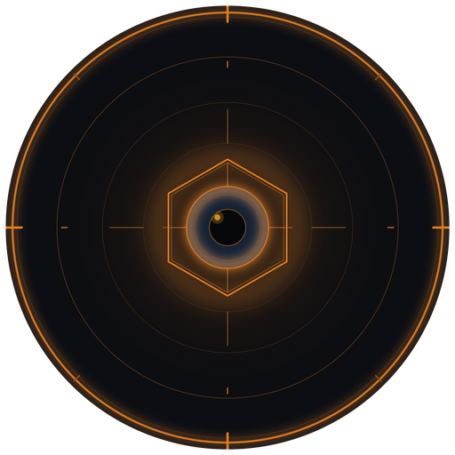
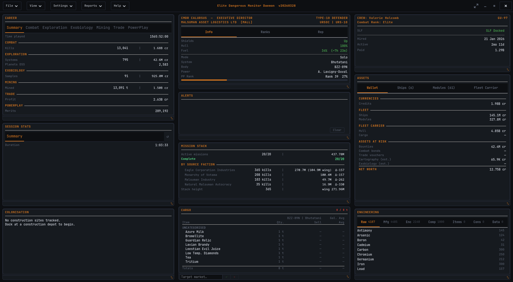
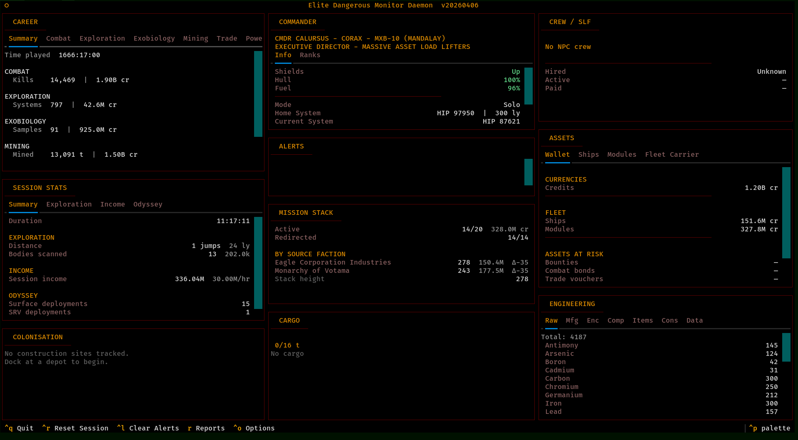
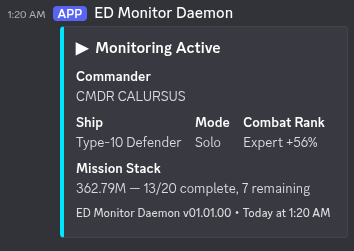

<div align="center">



# Elite Dangerous Monitor Daemon
### EDMD

**Real-time session monitoring dashboard for Elite Dangerous**

*Session tracking · Combat · Trade · Mining · Exploration · Missions · Exobiology · PowerPlay · Fleet assets · CAPI · Discord · Textual TUI · GTK4 GUI · Electron GUI*

---

Original code by **CMDR CALURSUS**

Maintained by **CMDR MALDOR96**, with permission

[](https://python.org)
[]()
[](https://github.com/Textualize/textual)
[]()
[]()

</div>

---

## Overview

EDMD is a real-time session monitoring dashboard for Elite Dangerous. It tails your journal and presents a live dashboard — a GTK4 window, a Textual terminal UI, or an Electron app — alongside the game, tracking everything you do across combat, trade, mining, exploration, missions, exobiology, and PowerPlay.

Alerts fire when things go wrong: shields down, hull taking damage, fuel running low, fighter destroyed. Session statistics accumulate across all activity types in a tabbed panel that shows only what's relevant to your current session.

All game state flows through a unified `DataProvider` — CAPI when authenticated, journal events and local JSON files as fallback.

---

## Features

| | |
|--|--|
| 💥 **Combat Tracking** | Kills, bounties, combat bonds, deaths, and fighter losses with per-kill timing and faction tally |
| 🎯 **Mission Stack** | Active massacre mission tracking — stack value, completion status, and full bootstrap on start |
| 📊 **Session Statistics** | Tabbed activity dashboard — Combat, Trade, Mining, Exploration, Missions, Exobiology, PowerPlay — showing totals and /hr rates |
| 🪟 **Electron GUI** | Cross-platform graphical interface (Windows, Linux, macOS) — self-contained installer on Windows (Python bundled), no prerequisites required |
| 🖥️ **GTK4 GUI** | Live graphical interface for Linux with all dashboard panels |
| 🖵 **Textual TUI** | Full terminal dashboard — same layout and data as the GUI. Runs on any machine with Python and a modern terminal |
| 🛡️ **Combat Alerts** | Shield drops, hull damage, fighter loss, ship destruction |
| ⛽ **Fuel Monitoring** | Warn and critical thresholds for fuel percentage and estimated time remaining |
| 🚨 **Security & Cargo Events** | Cargo scans, police scans, security attacks, low-value cargo notices |
| ⚠️ **Inactivity Warnings** | Alerts on kill rate drop or extended period without kills |
| 📈 **Statistical Reports** | Eight journal-wide reports: career overview, bounty breakdown, session history, hunting grounds, NPC rogues' gallery, exploration, exobiology, and PowerPlay |
| 📦 **Cargo Block** | Live ship hold display with tonnage gauge, per-item list, stolen-goods flagging, and Spansh market price comparison |
| ⚗️ **Engineering Block** | Engineering materials inventory across Raw, Manufactured, and Encoded categories |
| 🚀 **Assets Block** | Full fleet overview — current ship, stored ships with loadouts, stored modules, fleet carrier status |
| 🛡️ **Unified Data Provider** | Single source of truth for all game state — CAPI › journal › Status.json |
| 🌐 **Data Contributions** | Opt-in journal uploading to EDDN, EDSM, EDAstro, and Inara |
| 🏗️ **Colonisation Tracking** | Construction site resource requirements, delivery progress, and Raven Colonial integration (experimental) |

<div align="center">

<br><em>GTK4 GUI — default theme, live session in progress</em>
</div>

<div align="center">

<br><em>Textual TUI — same layout, no GTK4 required</em>
</div>

---

## Installation

**→ Full instructions: [INSTALL.md](INSTALL.md)**

### Windows

Download `EDMD-{version}-win.exe` from the [releases page](https://github.com/maldor/EDMD/releases). Run the installer — Python, all dependencies, and the EDMD source are bundled. No prerequisites required.

On first launch, if no `config.toml` exists, one is created automatically at `%APPDATA%\EDMD\config.toml`. Set `JournalFolder` to your Elite Dangerous journal directory. The default Windows location is:

```
C:\Users\YourName\Saved Games\Frontier Developments\Elite Dangerous
```

### Linux (Arch)
```bash
sudo pacman -S python-psutil python-gobject gtk4
pip install discord-webhook cryptography --break-system-packages
./install.sh
```

### Linux (Debian / Ubuntu)
```bash
sudo apt install python3-psutil python3-gi gir1.2-gtk-4.0
pip install discord-webhook cryptography --break-system-packages
bash install.sh
```

### Linux (Fedora)
```bash
sudo dnf install python3-psutil python3-gobject gtk4
pip install discord-webhook cryptography --break-system-packages
bash install.sh
```

> `psutil` and `PyGObject` have C extensions requiring system libraries — install them via your distro's package manager, not pip. See [INSTALL.md](INSTALL.md) for details.

---

## Quick Start

```bash
git clone https://github.com/maldor/EDMD.git
cd EDMD
bash install.sh          # Linux / macOS

./edmd.py                    # terminal output only
./edmd.py --mode textual      # Textual TUI
./edmd.py --mode gtk4         # GTK4 GUI (Linux)
./edmd.py --mode electron     # Electron GUI (all platforms)
./edmd.py -p MyProfile        # named config profile
```

If no `config.toml` exists, EDMD creates one with defaults and prints its location on startup. Set `JournalFolder` to your ED journal directory before proceeding.

---

## Config file locations

| Platform | Path |
|----------|------|
| Windows  | `%APPDATA%\EDMD\config.toml` |
| Linux    | `~/.local/share/EDMD/config.toml` |
| macOS    | `~/Library/Application Support/EDMD/config.toml` |

On Linux, `~/.config/EDMD` is a symlink to `~/.local/share/EDMD/`.

---

## Discord Integration

1. In Discord: **Edit Channel → Integrations → Webhooks → New Webhook**
2. Copy the webhook URL into `config.toml`:

```toml
[Discord]
WebhookURL = 'https://discord.com/api/webhooks/...'
UserID = 123456789012345678
```

`UserID` enables `@mention` pings on level-3 alerts. Find yours via Discord's Developer Mode (right-click your username).

<div align="center">

<br><em>Startup embed posted to Discord when monitoring begins</em>
</div>

---

## Documentation

| Document | Contents |
|----------|----------|
| [INSTALL.md](INSTALL.md) | Full installation instructions for all platforms |
| [Configuration](docs/CONFIGURATION.md) | All config keys, notification levels, CLI flags, profiles, data integrations (EDDN, EDSM, EDAstro, Inara, Raven Colonial) |
| [Terminal Output](docs/TERMINAL_OUTPUT.md) | Startup banner, event line format, sigil/tag reference, periodic summary |
| [GUI Theming](docs/THEMING.md) | Built-in themes, custom theme creation |
| [Mission Bootstrap](docs/MISSION_BOOTSTRAP.md) | How EDMD reconstructs mission state on startup |
| [Reports](docs/REPORTS.md) | Statistical reports — what each report covers and how data is sourced |

### Guides

| Guide | Description |
|-------|-------------|
| [Linux Setup](docs/guides/LINUX_SETUP.md) | Elite Dangerous on Linux with Steam, Proton, Minimal ED Launcher, EDMC, and EDMD |
| [Dual Pilot](docs/guides/DUAL_PILOT.md) | Two accounts simultaneously with independent journals and tool instances |
| [Remote Access](docs/guides/REMOTE_ACCESS.md) | EDMD GUI on a second machine as a thin client |

---

<div align="center">

*Fly safe out there, CMDR.*


**Elite Dangerous Monitor Daemon** · by CMDR CALURSUS

</div>
